# Solution Architecture

## Conversational Flow

## Voice Flow Steps

```mermaid
flowchart LR
    subgraph Flow["Agent Conversation Flow"]
        S1["1. Greeting"]
        S2["2. Get Phone Number"]
        S3["3. API Lookup"]
        S4{"4. Found?"}
        S5["5. Authenticate: Am I speaking with...?"]
        S6{"6. Confirmed?"}
        S7["7. Deliver Status"]
        S8["8. Handle Follow-up"]
        S9["9. Log & End Call"]
        
        F1["Fallback: Record not found"]
        F2["Fallback: Identity denied → Schedule callback"]
        F3["Escalation: Human agent request"]
    end

    S1 --> S2
    S2 --> S3
    S3 --> S4
    S4 -->|Yes| S5
    S4 -->|No| F1
    S5 --> S6
    S6 -->|Yes| S7
    S6 -->|No| F2
    S7 --> S8
    S8 --> S9
    
    S8 -.->|"Request human"| F3
    F1 --> S9
    F2 --> S9
    F3 --> S9
```

## Integration Points

| Layer | Technology | Purpose |
|-------|------------|---------|
| **Telephony** | VAPI | Manages inbound calls, routes audio |
| **STT** | VAPI (Deepgram/Whisper) | Converts caller speech → text |
| **LLM** | OpenAI GPT-4 | Understands intent, generates responses, calls tools |
| **TTS** | VAPI (ElevenLabs/PlayHT) | Converts agent text → speech |
| **Backend API** | FastAPI on Railway | Handles tool calls from LLM |
| **Database** | Airtable | Stores claims data and interaction logs |

## Monitoring & Logging

| Touchpoint | Location | What's Captured |
|------------|----------|-----------------|
| Request Received | FastAPI stdout | Incoming tool calls |
| Airtable Errors | FastAPI stdout | Connection failures, query errors |
| Validation Errors | API Response | Invalid sentiment, missing fields |
| Call Summary | Airtable Interactions | Caller name, summary, sentiment |
| VAPI Dashboard | VAPI | Full call transcripts, latency metrics |
